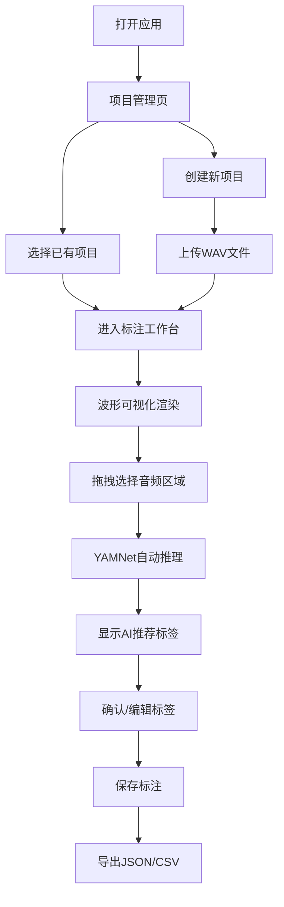

## 1. 产品概述
基于浏览器的音频事件标注工具，支持WAV文件加载、波形可视化、手动区域标注和AI自动标签建议。主要面向音频分析研究人员、机器学习数据标注人员，解决音频事件检测数据标注效率低的问题。

## 2. 核心功能

### 2.1 用户角色
| 角色 | 注册方式 | 核心权限 |
|------|----------|----------|
| 标注人员 | 无需注册，本地使用 | 音频加载、标注创建与编辑、导出标注结果 |

### 2.2 功能模块
1. **项目管理页**：项目列表、创建/删除项目、项目详情
2. **标注工作台**：波形可视化、区域选择、标注管理、AI标签建议
3. **导出功能**：支持JSON/CSV格式导出标注结果

### 2.3 页面详情
| 页面名称 | 模块名称 | 功能描述 |
|----------|----------|----------|
| 项目管理页 | 项目列表 | 展示所有项目，支持创建、删除、进入项目 |
| 项目管理页 | 项目创建 | 输入项目名称，上传音频文件创建新项目 |
| 标注工作台 | 波形可视化 | 使用wavesurfer.js展示音频波形，支持缩放、拖拽、播放控制 |
| 标注工作台 | 区域选择 | 鼠标拖拽框选波形区域，标记起止时间 |
| 标注工作台 | 标注管理 | 为选中区域添加标签（狗叫、鸣笛等），编辑、删除标注 |
| 标注工作台 | AI标签建议 | YAMNet模型后台推理，自动为选中区域推荐标签 |
| 标注工作台 | 播放控制 | 播放/暂停、进度跳转、音量控制、循环播放选中区域 |

## 3. 核心流程
用户打开应用 → 创建或选择项目 → 加载音频文件 → 波形渲染完成 → 在波形上拖拽选择区域 → 查看AI推荐标签 → 确认或手动输入标签 → 保存标注 → 导出标注结果

## 4. 用户界面设计

### 4.1 设计风格
- **主色调**：深邃蓝 (#1e3a5f) 作为主色，配合琥珀橙 (#f59e0b) 作为强调色，用于标注高亮
- **辅助色**： slate 色系作为中性色，构建专业的音频编辑界面
- **按钮风格**：圆润边角（8px），悬停时有微缩放和阴影变化，主按钮使用渐变效果
- **字体**：使用 JetBrains Mono 作为等宽字体展示时间码，Inter 作为界面字体
- **布局风格**：三栏布局 - 左侧标注列表、中间波形编辑区、右侧属性面板
- **视觉风格**：深色主题为主，专业音频编辑器风格，减少视觉疲劳

### 4.2 页面设计概述
| 页面名称 | 模块名称 | UI元素 |
|----------|----------|--------|
| 项目管理页 | 项目卡片 | 卡片式布局，显示项目名、音频时长、标注数量、创建时间 |
| 项目管理页 | 顶部导航 | Logo、创建项目按钮、帮助链接 |
| 标注工作台 | 波形区域 | 深色背景，彩色波形，时间轴刻度，播放头指示器 |
| 标注工作台 | 标注区域 | 半透明色块覆盖波形，不同标签使用不同颜色 |
| 标注工作台 | 侧边栏 | 标注列表可滚动，支持搜索过滤 |
| 标注工作台 | 底部控制栏 | 播放按钮、时间显示、缩放控制、音量滑块 |
| 标注工作台 | AI建议面板 | 置信度条形图，推荐标签列表，一键应用按钮 |

### 4.3 响应性
- 桌面端优先设计（1920px+），三栏布局
- 平板端折叠侧边栏为可滑出面板
- 移动端采用上下布局，波形区占主要空间

### 4.4 交互动效
- 页面加载时波形渐入，标注区域逐个淡入
- 区域选择时实时显示时间戳跟随鼠标
- AI推理时显示脉冲加载动画
- 标注保存成功后有轻微缩放反馈
