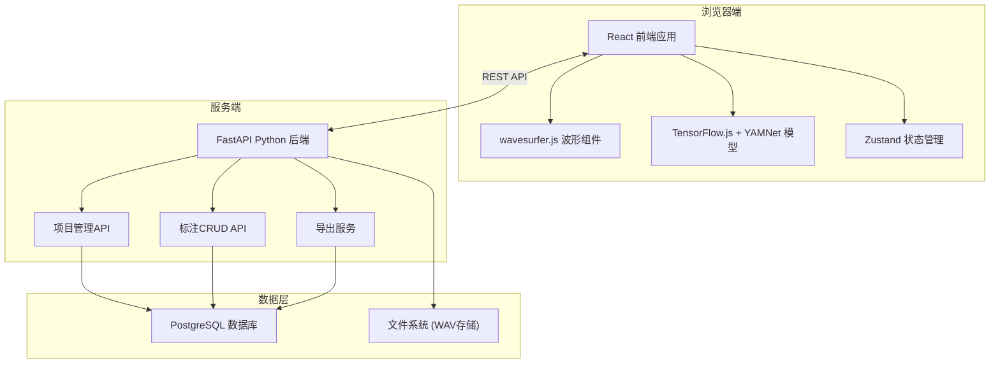
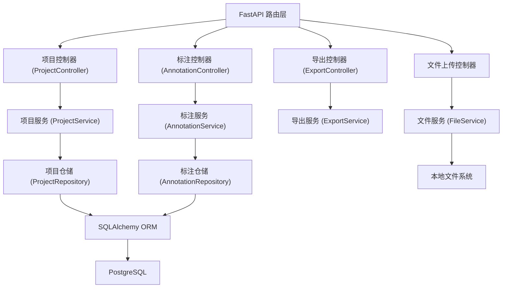
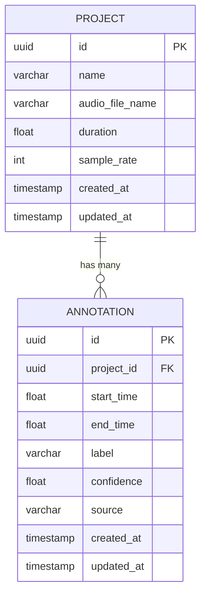

## 1. 架构设计


## 2. 技术描述
- **前端**：React@18 + TypeScript + Vite + TailwindCSS@3
- **状态管理**：Zustand
- **波形可视化**：wavesurfer.js@7 + regions 插件
- **AI推理**：@tensorflow/tfjs + YAMNet 预训练模型
- **图标**：lucide-react
- **后端**：Python@3.11 + FastAPI@0.100 + uvicorn
- **数据库**：PostgreSQL@15 + SQLAlchemy@2 + asyncpg
- **文件处理**：python-multipart + soundfile
- **API文档**：自动生成Swagger UI

## 3. 路由定义
| 路由 | 页面/用途 |
|------|----------|
| / | 项目管理首页 |
| /project/:id | 标注工作台 |
| /api/projects | 项目列表API |
| /api/projects/:id | 项目详情API |
| /api/projects/:id/annotations | 标注列表API |
| /api/export/:id | 导出标注API |

## 4. API 定义

### TypeScript 类型定义
```typescript
interface Project {
  id: string;
  name: string;
  audioFileName: string;
  duration: number;
  sampleRate: number;
  createdAt: string;
  updatedAt: string;
}

interface Annotation {
  id: string;
  projectId: string;
  startTime: number;
  endTime: number;
  label: string;
  confidence?: number;
  source: 'manual' | 'ai-suggested';
  createdAt: string;
}

interface TagSuggestion {
  label: string;
  confidence: number;
  yamnetClass: string;
}

interface ExportOptions {
  format: 'json' | 'csv';
  includeConfidence: boolean;
}
```

### API 接口
| 方法 | 路径 | 请求 | 响应 |
|------|------|------|------|
| GET | /api/projects | - | Project[] |
| POST | /api/projects | multipart/form-data (name, audioFile) | Project |
| DELETE | /api/projects/:id | - | { success: boolean } |
| GET | /api/projects/:id/annotations | - | Annotation[] |
| POST | /api/projects/:id/annotations | { startTime, endTime, label, confidence?, source? } | Annotation |
| PUT | /api/annotations/:id | { startTime?, endTime?, label? } | Annotation |
| DELETE | /api/annotations/:id | - | { success: boolean } |
| GET | /api/export/:id | ?format=json&includeConfidence=true | 文件下载 |

## 5. 服务端架构


## 6. 数据模型

### 6.1 ER图


### 6.2 DDL
```sql
CREATE EXTENSION IF NOT EXISTS "pgcrypto";

CREATE TABLE projects (
    id UUID PRIMARY KEY DEFAULT gen_random_uuid(),
    name VARCHAR(255) NOT NULL,
    audio_file_name VARCHAR(255) NOT NULL,
    duration FLOAT NOT NULL,
    sample_rate INTEGER NOT NULL,
    created_at TIMESTAMP WITH TIME ZONE DEFAULT CURRENT_TIMESTAMP,
    updated_at TIMESTAMP WITH TIME ZONE DEFAULT CURRENT_TIMESTAMP
);

CREATE TABLE annotations (
    id UUID PRIMARY KEY DEFAULT gen_random_uuid(),
    project_id UUID NOT NULL REFERENCES projects(id) ON DELETE CASCADE,
    start_time FLOAT NOT NULL,
    end_time FLOAT NOT NULL,
    label VARCHAR(100) NOT NULL,
    confidence FLOAT,
    source VARCHAR(20) NOT NULL DEFAULT 'manual',
    created_at TIMESTAMP WITH TIME ZONE DEFAULT CURRENT_TIMESTAMP,
    updated_at TIMESTAMP WITH TIME ZONE DEFAULT CURRENT_TIMESTAMP
);

CREATE INDEX idx_annotations_project_id ON annotations(project_id);
CREATE INDEX idx_annotations_time_range ON annotations(start_time, end_time);
```

### 6.3 预置标签数据
```sql
INSERT INTO labels (name, yamnet_classes, color) VALUES
('狗叫', 'Dog, Bark', '#ef4444'),
('汽车鸣笛', 'Vehicle horn, Car horn', '#f59e0b'),
('雨声', 'Rain', '#3b82f6'),
('鸟鸣', 'Bird, Bird vocalization', '#10b981'),
('人声', 'Speech, Human voice', '#8b5cf6'),
('背景音乐', 'Music, Background music', '#ec4899');
```
